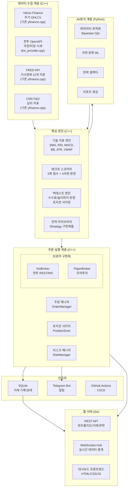

# libyfinance 프로젝트 기획서 (확정 v1.0)

> **프로젝트명**: libyfinance  
> **위치**: `/home/a17637/.hslee/private/libyfinance`  
> **목적**: 대한민국/미국 주식 시장 퀀트 기반 자동 거래 시스템  
> **확정일**: 2026-09-13  

---

## 1. 확정된 기술 결정사항

| 항목 | 결정 | 비고 |
|------|------|------|
| **핵심 엔진 언어** | C++ (유지) | 백테스트, 지표 연산, 전략 로직 등 성능 중요 영역 |
| **보조 언어** | Python | 데이터 분석, 전략 프로토타이핑, ML/AI, 유틸리티 스크립트 |
| **서버/웹** | Go | REST API 서버, 대시보드 백엔드, WebSocket 프록시 |
| **장기 검토** | Rust | 성능 크리티컬 모듈의 점진적 전환 후보 |
| **국장 브로커** | 한국투자증권 OpenAPI | 국장 + 미장 모두 지원, 모의투자 완벽 지원 |
| **미장 브로커** | 한국투자증권 (해외주식 API) | 동일 인프라로 미장 커버, 추후 IBKR/Alpaca 확장 가능 |
| **DB (Phase 1~3)** | SQLite | 로컬 거래 기록, 포트폴리오 상태 저장 |
| **DB (Phase 5)** | PostgreSQL | 멀티테넌트 전환 시 마이그레이션 |
| **알림** | Telegram Bot | 개인 사용 최적, 추후 Slack/Discord 확장 |
| **CI/CD** | GitHub Actions (기존 유지 + 확장) | 테스트 자동화, 대시보드 배포 |

---

## 2. 현재 코드베이스 분석 요약

### 2.1 기존 아키텍처
```
libyfinance/                    # C++17, CMake + Ninja
├── include/                    # 헤더 파일
│   ├── yfinance.hpp            # 정적 API 클라이언트 (Yahoo, FRED, CNN F&G)
│   ├── indicator.hpp           # 기술 지표 (SMA, RSI) - 헤더 온리
│   ├── stock_info.hpp          # StockInfo 구조체 (OHLCV 시계열)
│   ├── fng_info.hpp            # FearAndGreedInfo 구조체
│   ├── fred_info.hpp           # FredSeriesInfo 구조체
│   ├── macro_scorer.hpp        # 5축 매크로 스코어 + 4국면 판정
│   ├── strategy/istrategy.hpp  # IStrategy 순수 가상 인터페이스
│   ├── backtest/backtest_engine.hpp  # 단일종목 백테스트 엔진
│   └── macro/macro_backtester.hpp    # 포트폴리오 백테스트 엔진
├── src/                        # 구현체
│   ├── yfinance.cpp            # libcurl + nlohmann/json API 호출
│   ├── backtest/backtest_engine.cpp
│   └── macro/
│       ├── macro_backtester.cpp
│       └── macro_scorer.cpp
├── lib/                        # 전략 구현체
│   ├── rsi/                    # RSI(14, 30/70) 전략
│   └── sma_crossover/          # SMA(20/50) 골든/데스크로스 전략
├── app/                        # CLI 실행 파일 (9개)
├── config/                     # JSON 설정 (매크로 가중치, 전략 프로파일)
├── docs/                       # API 문서 + GitHub Pages 대시보드
└── .github/workflows/          # 일일 매크로 리포트 CI
```

### 2.2 핵심 인터페이스 (현재)

#### IStrategy (전략 인터페이스)
```cpp
enum class Signal { BUY, SELL, HOLD };

struct IStrategy {
    virtual ~IStrategy() = default;
    [[nodiscard]] virtual std::string name() const = 0;
    virtual void init(const StockInfo& data) = 0;
    [[nodiscard]] virtual std::size_t warmupPeriod() const = 0;
    [[nodiscard]] virtual Signal evaluate(const StockInfo& data, std::size_t index) = 0;
};
```

#### BacktestEngine
```cpp
class BacktestEngine {
public:
    explicit BacktestEngine(double initialCapital = 10000.0);
    [[nodiscard]] BacktestResult run(IStrategy& strategy, const StockInfo& data);
};
// BacktestResult: ticker, totalReturnPct, winRate, maxDrawdownPct, sharpeRatio, score(0~100), trades[]
```

#### 전략 등록 방식
- **현재**: 정적 링크 (CMakeLists.txt에 소스 직접 명시)
- 새 전략 추가 시: `lib/<name>/` 생성 → 루트 & app CMakeLists.txt에 수동 등록

---

## 3. 목표 디렉토리 구조

```
libyfinance/
├── include/                         # C++ 헤더 (기존 유지 + 확장)
│   ├── yfinance.hpp
│   ├── indicator.hpp                # → 추가 지표 (MACD, BB, ATR 등)
│   ├── stock_info.hpp
│   ├── fng_info.hpp
│   ├── fred_info.hpp
│   ├── macro_scorer.hpp
│   ├── strategy/
│   │   └── istrategy.hpp
│   ├── backtest/
│   │   └── backtest_engine.hpp      # → 수수료/슬리피지/포지션사이징 확장
│   ├── macro/
│   │   └── macro_backtester.hpp
│   ├── broker/                      # [NEW] 브로커 추상화 계층
│   │   ├── ibroker.hpp              # 브로커 인터페이스
│   │   ├── kis_broker.hpp           # 한투 OpenAPI 구현체
│   │   └── paper_broker.hpp         # Paper Trading 구현체
│   ├── order/                       # [NEW] 주문 관리
│   │   ├── order_manager.hpp        # 주문 생성/추적/체결확인
│   │   ├── position_sizer.hpp       # 포지션 사이징 (Kelly, 고정비율 등)
│   │   └── risk_manager.hpp         # 리스크 관리 (손절, MDD 제한)
│   └── data/                        # [NEW] 데이터 추상화
│       ├── idata_provider.hpp       # 데이터 소스 인터페이스
│       ├── yahoo_provider.hpp       # 야후 파이낸스 (기존 yfinance 리팩토링)
│       └── kis_provider.hpp         # 한투 시세 데이터
│
├── src/                             # C++ 구현체 (기존 유지 + 확장)
│   ├── yfinance.cpp
│   ├── backtest/
│   ├── macro/
│   ├── broker/                      # [NEW]
│   │   ├── kis_broker.cpp
│   │   └── paper_broker.cpp
│   ├── order/                       # [NEW]
│   │   ├── order_manager.cpp
│   │   ├── position_sizer.cpp
│   │   └── risk_manager.cpp
│   └── data/                        # [NEW]
│       └── kis_provider.cpp
│
├── lib/                             # 전략 구현체 (기존 유지 + 확장)
│   ├── rsi/
│   ├── sma_crossover/
│   ├── macd/                        # [NEW]
│   ├── bollinger/                   # [NEW]
│   ├── momentum/                    # [NEW]
│   └── mean_reversion/              # [NEW]
│
├── app/                             # CLI 실행 파일 (기존 유지 + 확장)
│   ├── (기존 9개 유지)
│   ├── trader.cpp                   # [NEW] 자동매매 데몬
│   └── paper_trader.cpp             # [NEW] 모의투자 데몬
│
├── python/                          # [NEW] Python 보조 모듈
│   ├── pyproject.toml
│   ├── libyfinance/
│   │   ├── __init__.py
│   │   ├── analysis/                # 데이터 분석, 시각화
│   │   │   ├── portfolio_analyzer.py
│   │   │   └── report_generator.py
│   │   ├── ml/                      # ML/AI 전략 (Phase 4)
│   │   │   ├── param_optimizer.py   # Bayesian Optimization
│   │   │   ├── regime_classifier.py # ML 국면 분류
│   │   │   └── strategy_selector.py # 적응형 전략 선택
│   │   └── utils/
│   │       ├── telegram_bot.py      # 알림 봇
│   │       └── db.py                # SQLite 유틸리티
│   └── tests/
│
├── server/                          # [NEW] Go 웹 서버 (Phase 3)
│   ├── go.mod
│   ├── cmd/
│   │   └── dashboard/main.go        # 대시보드 서버 엔트리
│   ├── internal/
│   │   ├── api/                     # REST API 핸들러
│   │   │   ├── portfolio.go
│   │   │   ├── trades.go
│   │   │   └── strategies.go
│   │   ├── ws/                      # WebSocket (실시간 데이터 중계)
│   │   │   └── hub.go
│   │   └── middleware/
│   │       └── auth.go              # (Phase 5) 인증
│   ├── web/                         # 프론트엔드 정적 파일
│   │   └── (HTML/CSS/JS)
│   └── templates/
│
├── config/                          # 설정 (기존 유지 + 확장)
│   ├── macro_allocation.json
│   ├── macro_sweep.json
│   ├── strategies/                  # 매크로 전략 프로파일
│   │   ├── aggressive.json
│   │   ├── balanced.json
│   │   └── defensive.json
│   ├── broker/                      # [NEW] 브로커 설정
│   │   ├── kis_real.json            # 실전 투자 설정
│   │   └── kis_paper.json           # 모의 투자 설정
│   ├── trading/                     # [NEW] 거래 설정
│   │   ├── risk_limits.json         # 리스크 한도
│   │   └── schedule.json            # 거래 스케줄
│   └── alerts/                      # [NEW] 알림 설정
│       └── telegram.json
│
├── tests/                           # [NEW] C++ 테스트
│   ├── CMakeLists.txt
│   ├── test_indicator.cpp
│   ├── test_backtest_engine.cpp
│   ├── test_strategies.cpp
│   ├── test_macro_scorer.cpp
│   └── mock/
│       └── mock_data.hpp            # 테스트용 mock JSON
│
├── data/                            # [NEW] 로컬 데이터 저장소
│   ├── trades.db                    # SQLite (거래 기록)
│   └── cache/                       # API 응답 캐시
│
├── docs/                            # (기존 유지 + 확장)
├── .github/workflows/               # (기존 유지 + 확장)
├── CMakeLists.txt
├── Dockerfile
├── docker.sh
├── make.sh
└── .env.example                     # [NEW] 환경변수 템플릿
```

---

## 4. 시스템 아키텍처



---

## 5. Phase별 구체적 구현 계획

---

### Phase 1: 기반 강화

> [!IMPORTANT]
> 실거래 전 필수 선행 작업. 기존 코드의 안정성과 현실성을 확보하는 단계.

#### 1-A. 테스트 프레임워크 도입

**목표**: GTest 기반 단위 테스트 환경 구축, 기존 핵심 로직 테스트 커버리지 확보

| 태스크 | 파일 | 설명 |
|--------|------|------|
| GTest 의존성 추가 | `CMakeLists.txt` | `FetchContent`로 googletest 다운로드 + 빌드 |
| 테스트 빌드 설정 | `tests/CMakeLists.txt` | 테스트 타깃 정의, CTest 연동 |
| 지표 테스트 | `tests/test_indicator.cpp` | SMA/RSI 연산을 수작업 계산 결과와 비교 검증 |
| 백테스트 엔진 테스트 | `tests/test_backtest_engine.cpp` | 알려진 시나리오(상승장, 하락장, 횡보장)에서 기대 결과 검증 |
| 전략 테스트 | `tests/test_strategies.cpp` | SMA Crossover, RSI 전략의 시그널 정확성 검증 |
| 매크로 스코어 테스트 | `tests/test_macro_scorer.cpp` | 특정 입력에 대한 국면 판정 결과 검증 |
| Mock 데이터 | `tests/mock/mock_data.hpp` | 테스트용 StockInfo, FredSeriesInfo JSON 생성 유틸리티 |
| CI 테스트 워크플로우 | `.github/workflows/test.yml` | PR마다 `make.sh` + `ctest` 자동 실행 |

**구현 세부사항**:
```cmake
# tests/CMakeLists.txt
include(FetchContent)
FetchContent_Declare(
  googletest
  GIT_REPOSITORY https://github.com/google/googletest.git
  GIT_TAG        v1.14.0
)
FetchContent_MakeAvailable(googletest)

enable_testing()

add_executable(libyfinance_tests
  test_indicator.cpp
  test_backtest_engine.cpp
  test_strategies.cpp
  test_macro_scorer.cpp
)
target_link_libraries(libyfinance_tests
  GTest::gtest_main
  yfinance::yfinance
)
include(GoogleTest)
gtest_discover_tests(libyfinance_tests)
```

#### 1-B. 백테스트 현실성 향상

**목표**: 거래 비용, 포지션 사이징을 반영하여 백테스트 결과의 신뢰성 향상

| 태스크 | 변경 대상 | 설명 |
|--------|-----------|------|
| `BacktestConfig` 구조체 추가 | `include/backtest/backtest_engine.hpp` | 수수료율, 슬리피지, 세금률, 포지션사이징 방식 설정 |
| `run()` 시그니처 확장 | `backtest_engine.hpp/cpp` | `run(strategy, data, config)` 오버로드 추가 |
| 수수료 차감 로직 | `backtest_engine.cpp` | 매수/매도 시 `price *= (1 ± commission + slippage)` |
| 부분 매매 지원 | `backtest_engine.cpp` | 전액이 아닌 비율/수량 기반 매매 |
| 세금 반영 | `backtest_engine.cpp` | 매도 수익에 대한 양도세 차감 (설정 가능) |
| `Trade` 구조체 확장 | `backtest_engine.hpp` | `commission`, `slippage`, `tax` 필드 추가 |

**인터페이스 설계**:
```cpp
struct BacktestConfig {
    double commissionRate = 0.00015;  // 수수료율 (0.015%, 한투 기준)
    double slippagePct    = 0.001;    // 슬리피지 (0.1%)
    double taxRate        = 0.0;      // 양도세율 (국장 대주주 외 0%, 미장 22%)
    double positionPct    = 1.0;      // 포지션 비율 (1.0 = 전액, 0.5 = 50%)
    bool   reinvestDividends = false; // 배당 재투자 여부
};
```

#### 1-C. 추가 기술 지표

**목표**: `include/indicator.hpp`에 실전에서 자주 사용하는 지표 추가

| 지표 | 함수 시그니처 | 설명 |
|------|--------------|------|
| MACD | `macd(closes, fast, slow, signal)` → `{macd_line, signal_line, histogram}` | 추세 전환 포착 |
| 볼린저 밴드 | `bollinger(closes, period, stddev)` → `{upper, middle, lower}` | 변동성 밴드 |
| ATR | `atr(high, low, close, period)` → `vector<double>` | 변동성 측정, 손절폭 결정에 활용 |
| VWAP | `vwap(high, low, close, volume)` → `vector<double>` | 기관 매매 기준가 |
| 스토캐스틱 | `stochastic(high, low, close, k, d)` → `{k_line, d_line}` | 과매수/과매도 판단 |

#### 1-D. 한국 시장 데이터 수집

**목표**: 한투 OpenAPI를 통해 국장 시세 데이터를 기존 `StockInfo`와 동일 포맷으로 수집

| 태스크 | 파일 | 설명 |
|--------|------|------|
| 데이터 소스 인터페이스 | `include/data/idata_provider.hpp` | `getStockInfo()` 가상 인터페이스 |
| 야후 프로바이더 | `include/data/yahoo_provider.hpp` | 기존 `yFinance::getStockInfo` 래핑 |
| 한투 프로바이더 | `include/data/kis_provider.hpp` + `src/data/kis_provider.cpp` | KIS REST API로 일봉/주봉 OHLCV 조회 |
| 한투 인증 모듈 | `src/broker/kis_auth.cpp` | OAuth2 토큰 발급 + 24시간 캐싱 |
| 환경변수 템플릿 | `.env.example` | `KIS_APP_KEY`, `KIS_APP_SECRET`, `KIS_ACCOUNT_NO` 등 |

**IDataProvider 인터페이스 설계**:
```cpp
struct IDataProvider {
    virtual ~IDataProvider() = default;
    [[nodiscard]] virtual std::string name() const = 0;

    // 종목 시세 조회 (StockInfo 형식으로 통일)
    [[nodiscard]] virtual std::shared_ptr<StockInfo>
    getStockInfo(std::string_view ticker,
                 std::string_view startDate,
                 std::string_view endDate,
                 std::string_view interval = "1d") = 0;
};
```

**한투 OpenAPI 연동 핵심 정보**:
```
# 엔드포인트
실전: https://openapi.koreainvestment.com:9443
모의: https://openapivts.koreainvestment.com:29443

# 인증
POST /oauth2/tokenP
Body: {"grant_type":"client_credentials", "appkey":"...", "appsecret":"..."}
→ access_token (24시간 유효, 1일 1회 발급 권장)

# 공통 헤더
authorization: Bearer {token}
appkey: {AppKey}
appsecret: {AppSecret}
tr_id: {거래고유ID}
custtype: P

# Rate Limit
실전: 20 TPS / 모의: 5 TPS
→ Token Bucket 또는 최소 50ms(실전)/200ms(모의) 간격 필수
```

---

### Phase 2: 실거래 연동

> [!CAUTION]
> 실제 자금이 관여됩니다. 반드시 Paper Trading(모의투자)으로 최소 3개월 검증 후 실전 전환하세요.

#### 2-A. 브로커 추상화 계층

**목표**: 모의/실전 투자를 동일 인터페이스로 처리하는 브로커 계층 구축

**IBroker 인터페이스 설계**:
```cpp
// include/broker/ibroker.hpp

enum class OrderSide { BUY, SELL };
enum class OrderType { MARKET, LIMIT };
enum class OrderStatus { PENDING, FILLED, PARTIAL, CANCELLED, REJECTED };
enum class Market { KR, US };  // 국장/미장

struct OrderRequest {
    Market      market;
    std::string ticker;          // "005930" (삼성전자) 또는 "AAPL"
    OrderSide   side;
    OrderType   type;
    int         quantity;
    double      limitPrice = 0;  // LIMIT 주문 시 지정가
};

struct OrderResult {
    std::string orderId;
    OrderStatus status;
    double      filledPrice;
    int         filledQuantity;
    double      commission;
    std::string message;
    std::string timestamp;
};

struct Position {
    std::string ticker;
    Market      market;
    int         quantity;
    double      avgPrice;       // 평균 매수가
    double      currentPrice;   // 현재가
    double      pnl;            // 평가손익
    double      pnlPct;         // 수익률 (%)
};

struct AccountBalance {
    double      totalAsset;     // 총 자산
    double      cashBalance;    // 예수금
    double      stockValue;     // 주식 평가액
    std::vector<Position> positions;
};

struct IBroker {
    virtual ~IBroker() = default;
    [[nodiscard]] virtual std::string name() const = 0;
    [[nodiscard]] virtual bool isLive() const = 0;  // 실전 vs 모의

    // 주문
    [[nodiscard]] virtual OrderResult submitOrder(const OrderRequest& req) = 0;
    [[nodiscard]] virtual OrderResult cancelOrder(const std::string& orderId) = 0;
    [[nodiscard]] virtual OrderResult getOrderStatus(const std::string& orderId) = 0;

    // 잔고
    [[nodiscard]] virtual AccountBalance getBalance() = 0;
    [[nodiscard]] virtual std::vector<Position> getPositions() = 0;
};
```

| 구현체 | 파일 | 설명 |
|--------|------|------|
| `KisBroker` | `src/broker/kis_broker.cpp` | 한투 REST API 호출. 국장/미장 TR_ID 자동 분기 |
| `PaperBroker` | `src/broker/paper_broker.cpp` | 한투 모의투자 API (`openapivts`, `V` 접두 TR_ID) |

**한투 API TR_ID 매핑**:
```
                  실전           모의
국장 매수      TTTC0802U     VTTC0802U
국장 매도      TTTC0801U     VTTC0801U
국장 정정/취소  TTTC0803U     VTTC0803U
국장 잔고      TTTC8434R     VTTC8434R
미장 매수      TTTT1002U     VTTT1002U
미장 매도      TTTT1006U     VTTT1001U
미장 잔고      TTTS3012R     VTTS3012R
현재가(국장)   FHKST01010100  (동일)
현재가(미장)   HHDFS00000300  (동일)
```

#### 2-B. 주문 관리 시스템

| 모듈 | 파일 | 역할 |
|------|------|------|
| `OrderManager` | `include/order/order_manager.hpp` | 전략 시그널 → 주문 변환, 체결 확인, 상태 추적 |
| `PositionSizer` | `include/order/position_sizer.hpp` | 포지션 크기 결정 (고정비율, Kelly, 변동성 기반) |
| `RiskManager` | `include/order/risk_manager.hpp` | 리스크 한도 검증 후 주문 승인/거부 |

**PositionSizer 인터페이스**:
```cpp
enum class SizingMethod { FIXED_PCT, KELLY, VOLATILITY_TARGET };

struct PositionSizer {
    SizingMethod method = SizingMethod::FIXED_PCT;
    double fixedPct     = 0.1;    // 전체 자산의 10%
    double kellyFraction = 0.5;   // Half-Kelly
    double volTarget     = 0.15;  // 연간 변동성 15% 목표

    [[nodiscard]] int calculate(double cashBalance, double price,
                                double winRate = 0, double avgWin = 0,
                                double avgLoss = 0, double volatility = 0) const;
};
```

**RiskManager 설정** (`config/trading/risk_limits.json`):
```json
{
    "max_daily_loss_pct": 3.0,
    "max_position_pct": 20.0,
    "max_portfolio_drawdown_pct": 15.0,
    "max_single_order_pct": 10.0,
    "max_open_positions": 10,
    "trading_hours": {
        "kr": {"open": "09:00", "close": "15:30"},
        "us": {"open": "09:30", "close": "16:00", "timezone": "America/New_York"}
    }
}
```

#### 2-C. 자동매매 데몬

| 파일 | 설명 |
|------|------|
| `app/trader.cpp` | 메인 트레이딩 루프. 설정 로드 → 데이터 수집 → 전략 실행 → 주문 → 대기 반복 |
| `app/paper_trader.cpp` | `trader.cpp`와 동일 로직, `PaperBroker` 사용 |
| `config/trading/schedule.json` | 실행 스케줄 (장 시작 전 데이터 수집, 장중 시그널 체크 주기 등) |

**Trading Loop 의사코드**:
```
1. 설정 로드 (broker, strategy, risk_limits, schedule)
2. 브로커 초기화 (KisBroker 또는 PaperBroker)
3. LOOP:
   a. 현재 시각 체크 → 거래 시간 외면 sleep
   b. 시세 데이터 수집 (KIS 또는 Yahoo)
   c. 보유 포지션 조회
   d. 각 감시 종목에 대해:
      - strategy.init(data) + strategy.evaluate(data, latest)
      - signal == BUY → PositionSizer.calculate() → RiskManager.check()
                       → OrderManager.submit()
      - signal == SELL → OrderManager.submit(전량 매도)
   e. 체결 결과 확인 및 DB 기록
   f. 알림 발송 (Telegram)
   g. 다음 체크 시각까지 sleep
```

---

### Phase 3: 대시보드 & 알림

#### 3-A. Go 웹 서버

**목표**: 포트폴리오, 거래 내역, 전략 성과를 실시간으로 볼 수 있는 웹 대시보드

| 모듈 | 파일 | 설명 |
|------|------|------|
| 서버 엔트리 | `server/cmd/dashboard/main.go` | HTTP 서버 + 정적 파일 서빙 |
| 포트폴리오 API | `server/internal/api/portfolio.go` | `GET /api/portfolio` - 잔고, 보유종목, PnL |
| 거래 내역 API | `server/internal/api/trades.go` | `GET /api/trades` - 체결 내역 조회 (필터/페이징) |
| 전략 API | `server/internal/api/strategies.go` | `GET /api/strategies` - 전략별 성과 |
| 매크로 API | `server/internal/api/macro.go` | 기존 `docs/data.json` 연동 |
| WebSocket | `server/internal/ws/hub.go` | 실시간 시세/체결 푸시 |

**REST API 설계**:
```
GET  /api/portfolio              → AccountBalance (잔고 + 보유종목)
GET  /api/portfolio/history      → 일별 총자산 추이
GET  /api/trades?from=&to=&ticker= → 거래 내역 (필터링)
GET  /api/trades/summary         → 일별/월별 손익 요약
GET  /api/strategies             → 활성 전략 목록 및 성과
GET  /api/macro                  → 현재 매크로 국면/점수
WS   /ws/realtime                → 실시간 시세 스트림
```

**데이터 소스**: Go 서버는 SQLite DB (`data/trades.db`)를 읽고, C++ 트레이딩 데몬이 DB에 기록하는 구조.

```
[C++ trader] --write--> [SQLite DB] <--read-- [Go server] --serve--> [Browser]
```

#### 3-B. 프론트엔드

**기존 `docs/index.html`** (매크로 대시보드)를 확장하거나, 별도의 SPA 구축.

| 페이지 | 내용 |
|--------|------|
| **Overview** | 총 자산, 일일 PnL, 자산 배분 차트, 매크로 국면 배지 |
| **Portfolio** | 보유 종목 테이블, 종목별 수익률, 섹터/시장별 비중 |
| **Trades** | 체결 내역 테이블 (정렬/필터), 일별 거래 수익 차트 |
| **Strategies** | 전략별 성과 비교 (수익률, 승률, 샤프), 시그널 히스토리 |
| **Macro** | 기존 매크로 대시보드 통합 (국면, 점수, 배분 차트) |
| **Settings** | 전략 선택, 리스크 한도, 알림 설정 |

#### 3-C. Telegram 알림

| 파일 | 설명 |
|------|------|
| `python/libyfinance/utils/telegram_bot.py` | Telegram Bot API 래퍼 |
| `config/alerts/telegram.json` | `bot_token`, `chat_id`, 알림 종류별 활성화 여부 |

**알림 종류**:
```
📈 매수 체결: [삼성전자] 10주 × 72,500원 (전략: SMA Crossover)
📉 매도 체결: [AAPL] 5주 × $198.50 (수익: +3.2%)
📊 일일 리포트: 총자산 ₩45,230,000 (+1.2%), 매크로: Expansion
⚠️ 리스크 경고: 일일 손실 -2.5% (한도 -3.0%)
🔴 장애 알림: KIS API 연결 실패 (3회 연속)
```

---

### Phase 4: AI / 적응형 전략

#### 4-A. C++↔Python 연동 방식

두 가지 접근법 중 택 1 (또는 병행):

| 방식 | 구현 | 장점 | 단점 |
|------|------|------|------|
| **프로세스 통신** | C++ 트레이더가 Python 스크립트를 subprocess로 호출, JSON으로 데이터 교환 | 단순, 의존성 분리 | 호출 오버헤드 |
| **공유 DB** | Python이 SQLite에 추천 결과를 쓰고, C++이 읽음 | 비동기 가능, 느슨한 결합 | 동기화 관리 필요 |

> [!TIP]
> Phase 4 초기에는 **프로세스 통신(subprocess + JSON)** 방식을 권장합니다. 
> 단순하고 디버깅이 쉬우며, 추후 gRPC 등으로 전환 가능합니다.

#### 4-B. 파라미터 최적화

| 파일 | 설명 |
|------|------|
| `python/libyfinance/ml/param_optimizer.py` | Bayesian Optimization (optuna 활용) |

**동작 흐름**:
```
1. Python이 파라미터 후보 생성 (예: SMA 단기=15, 장기=45)
2. 파라미터를 JSON으로 직렬화 → C++ 백테스트 엔진 호출
3. BacktestResult (score, sharpe, mdd) 수신
4. Optuna가 다음 후보 결정
5. 반복 (N trials)
6. 최적 파라미터를 config/에 저장
```

#### 4-C. 적응형 전략 선택

| 파일 | 설명 |
|------|------|
| `python/libyfinance/ml/strategy_selector.py` | 시장 상태에 따른 전략 추천 |

**로직**:
```
1. 최근 N일 시장 데이터 특성 추출:
   - 변동성 (ATR), 추세 강도 (ADX), 거래량 변화율
   - 매크로 국면 (MacroScorer 결과)
2. 과거 동일 조건에서 각 전략의 성과 비교 (lookback backtest)
3. 최적 전략 또는 전략 가중치 조합 추천
4. JSON으로 결과 출력 → C++ 트레이더가 적용
```

#### 4-D. 추가 전략 구현

| 전략 | 디렉토리 | 핵심 로직 |
|------|----------|-----------|
| MACD | `lib/macd/` | MACD 라인이 시그널 라인 상향 돌파 시 BUY, 하향 시 SELL |
| 볼린저 밴드 | `lib/bollinger/` | 하단 터치 시 BUY, 상단 터치 시 SELL (평균회귀) |
| 모멘텀 | `lib/momentum/` | 3/6/12개월 수익률 상위 종목 매수, 하위 매도 |
| 평균회귀 | `lib/mean_reversion/` | Z-score 기반 극단값에서 역방향 진입 |

각 전략은 `IStrategy` 상속, `lib/<name>/<name>.hpp + .cpp` 구조, CMakeLists.txt에 등록.

---

### Phase 5: 상용화 (멀티테넌트)

> [!NOTE]
> Phase 1~4 안정화 이후 진행. 여기서는 방향성만 정리합니다.

#### 5-A. 아키텍처 변경

```
[개인용 단일 프로세스]  →  [멀티테넌트 서비스]

SQLite        → PostgreSQL
Go 단일 서버  → Go + Docker Compose (→ K8s)
파일 설정     → DB 기반 사용자별 설정
없음          → OAuth2 인증 + JWT
없음          → 구독/과금 시스템
```

#### 5-B. 주요 태스크

| 영역 | 태스크 |
|------|--------|
| **인증** | OAuth2 (Google/Kakao) 로그인, JWT 토큰, 세션 관리 |
| **멀티테넌트** | 사용자별 독립 포트폴리오, 전략 설정, API 키 (한투 계정) |
| **과금** | 구독 Tier (Basic: 1전략, Pro: 무제한, Enterprise: 맞춤) |
| **인프라** | Docker Compose → K8s, PostgreSQL, Redis (캐시), Prometheus + Grafana |
| **보안** | API 키 암호화 저장, 감사 로그, 접근 제어 |

---

## 6. 의존성 요약

### C++
| 라이브러리 | 용도 | 설치 |
|-----------|------|------|
| `libcurl` | HTTP 요청 (기존) | `apt install libcurl4-openssl-dev` |
| `nlohmann/json` | JSON 파싱 (기존) | `apt install nlohmann-json3-dev` |
| `googletest` | 단위 테스트 (Phase 1) | CMake FetchContent |
| `Boost.Beast` 또는 `ixwebsocket` | WebSocket (Phase 2) | KIS 실시간 체결 수신용 |
| `SQLite3` | 로컬 DB (Phase 2) | `apt install libsqlite3-dev` |

### Python
| 패키지 | 용도 | Phase |
|--------|------|-------|
| `httpx` | KIS API 호출 (비동기) | 2 |
| `python-telegram-bot` | Telegram 알림 | 3 |
| `optuna` | Bayesian Optimization | 4 |
| `scikit-learn` | ML 국면 분류 | 4 |
| `pandas` | 데이터 분석 | 4 |

### Go
| 패키지 | 용도 | Phase |
|--------|------|-------|
| `net/http` (stdlib) | REST API 서버 | 3 |
| `gorilla/websocket` 또는 `nhooyr.io/websocket` | WebSocket | 3 |
| `mattn/go-sqlite3` | SQLite 연동 | 3 |

---

## 7. 환경변수 템플릿 (`.env.example`)

```bash
# 한국투자증권 OpenAPI
KIS_APP_KEY=your_app_key
KIS_APP_SECRET=your_app_secret
KIS_ACCOUNT_NO=12345678        # 종합계좌번호 앞 8자리
KIS_ACCOUNT_PROD=01             # 계좌상품코드
KIS_MODE=paper                  # paper | live

# FRED API
FRED_API_KEY=your_fred_api_key

# Telegram
TELEGRAM_BOT_TOKEN=your_bot_token
TELEGRAM_CHAT_ID=your_chat_id

# 서버
DASHBOARD_PORT=8080
DASHBOARD_HOST=0.0.0.0
```

---

## 8. 작업 진행 규칙

1. **각 Phase는 순차적으로 진행**. Phase N 완료 전 Phase N+1 시작 금지.
2. **Phase 2 진입 전**: 모든 Phase 1 테스트 통과 + Paper Trading 환경 준비 완료.
3. **Phase 2 → 실전 전환 전**: Paper Trading 최소 3개월 + 양수 수익률 달성.
4. **코드 변경 시**: 관련 테스트 추가/수정 필수.
5. **Git**: feature branch → PR → 테스트 통과 → merge.
6. **설정 변경은 코드 변경 없이** 가능하도록 JSON/env 분리 원칙 유지.
